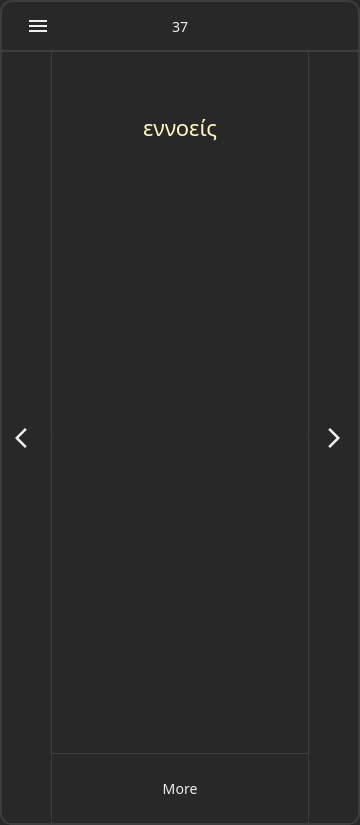
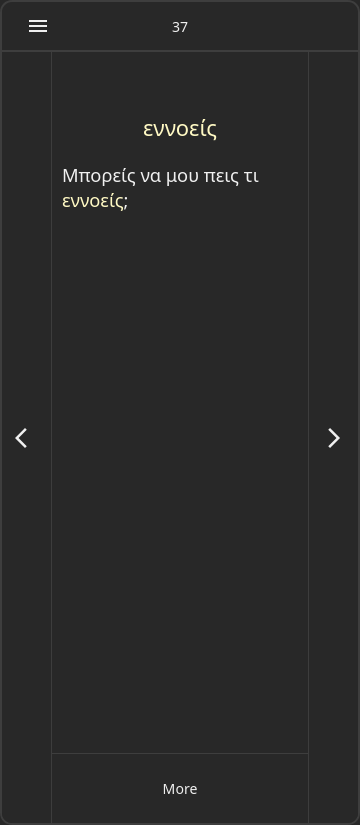
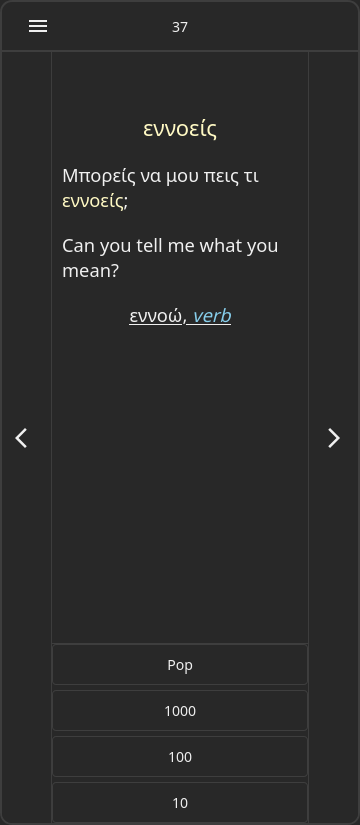

# Lexico

Greek learning dictionary.

Two types of articles: 

- Word form with example use (short sentence with translation).

- Lemma with word forms and grammatical annotations.

Articles are viewed one by one. The user controls repetition frequency by placing the current article 
to the end or somewhere in the middle of the queue.









## Building for Android

```bash
git submodule update --init --recursive
make build_apk
```

Find .apk file in [tauriapp/dist/](tauriapp/dist/) folder.
