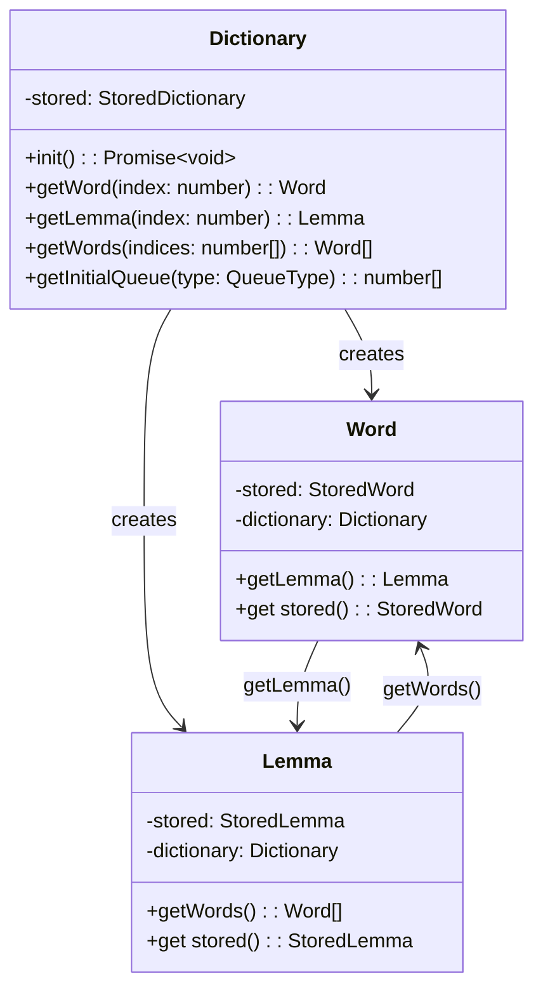

# User Interface of Learning Greek Dictionary

The unit of display ("page", "screen") is called an "article" (dictionary article).

There are two kinds of articles: 

**Lemma articles**: display lemma and all word forms with grammatical information 
as well as one or many use examples (short sentences with English translation).

**Word articles**: display word form, grammatical information, and one use example.

Different parts of the article are displayed sequencially as the user presses the "Next" button.

For lemma articles, such parts are: lemma, translation, use examples, all word forms with grammatical information.

For word articles, such parts are: word form, grammatical information, use example.

After the artcle is fully displayed, the use chooses the next position of this article in the display queue.
E.g. move by 10, 100, or 1000 articles or to the end of the queue. This reflects user's recall of the article.

There are several article queues maintained: one for words, one for full list of lemmas, and one for every list of lemmas by part of speech.

These queues are initialized by the order of items in the immutable database (from most frequent to least frequent).
As user progresses through the articles, the selected queue changes.

The user can switch between queues at any time.

Queues are stored locally (e.g. in browser's local storage).

This application works without a backend. The database is represented by JSON object downloaded at startup and stored locally.
This database is immutable. Python definitions used to created database JSON object can be found in `dictionary.py`.
Root object corresponds to `Dictionary' class.

The user can reload database to store locally the latest version.

## UI components

- Menu:
  + Reload database
  + Words (switches to the words queue)
  + Lemmas (switches to the lemmas queue)
  + Verbs (switches to the verb lemmas queue)
  + Nouns (switches to the noun lemmas queue)
  + Adjectives (switches to the adjective lemmas queue)
  + Adverbs (switches to the adverb lemmas queue)
  + Other (switches to the lemmas queue, representing other parts of speech)
  

- Position selector (select current position in the current queue):
  + Input with shift to front (negative values) or to back (positive values)
  + Slider to select the shift to front (negative values) or to back (positive values)
  
- Move selector (select offset for the next position of currently displayed article in the current queue):
  + Move by 10
  + Move by 100
  + Move by 1000
  + Move to the end

- Menu button

- Article display area (scrollable)

- Home screen

- Queue screen: queue name, reset button, current position selector

- Contextual control panel: next button, move selector

## Layout

Top row with menu button.

Bottom row with main display area to show:

- Home screen
- menu
- queue screen
- article: top row the article itself, bottom row the contextual control panel

## Behavior

- Home page (/):
  Check if state is initialized:
  If yes: 
    Check if current queue is set:
    If yes: route to /article/{queue_type}/{index} (display current article)
    If no: route to /menu
  If no: run useInitializeState(), display "Loading database..." message, after done, go to yes branch
  
- Dictionary page (/dictionary):
  Display some welcome text.
  Check if state is initialized:
      If yes: show "Reload database" button and below "Menu" button (yes additional button).
      In no: show "Load database" button.
  Pressing button: Message "Loading database..." instead of the button, and then navigating to home page
  Pressing menu button, routes to /menu.


- Pressing other buttons of the menu:
  + marks selection of the current queue
  + opens the queue screen
    
- Queue screen: contains selector and OK button.
  + Changing the selector, changes current position in the current queue.
  + Pressing OK button, brings in article screen.
  
- Article screen:
  + Pressing "Next" button, progresses display of the article.
  + After the article is fully displayed, the contextual control panel shows the move selector.
    Changing the selector:
    * sets the next position of the article in the current queue
    * brings in the next article
  + When on word article, there should be a "Lemma" button on the contextual control panel, pressing it switches to lemma article with "Back" button
    on the contextual control panel to return to the word article.
    
## Routes

/ (Home page)

/menu

/queue/{type}

/word/{index}

/lemma/{index}

## Data structures

Queue can be represented as array of indices. 
The most frequent operation will be modifying this array (pop from front, insert in the middle).
Therefore, it makes no sense to store position in the queue separately. 
Let the front of the queue be always at index 0 (the index stored at index 0 points to the current article).
After each modification of the queue we will have to store the entire queue array locally anyway.

Selecting current arcticle next position: pop + insert.
Selecting initial position: cut in 2 parts, append left part to the end of right part.

## Development

```bash
npm run dev
```

## Domain objects


